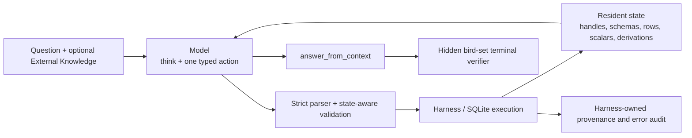

# 当前表格工具设计与动机报告

更新时间：2026-07-30

## 1. 执行摘要

本项目不让模型直接生成 SQL，而是让模型在一个真实的 model↔harness 闭环中逐步调用
typed table tools。Harness 负责执行关系操作、维护 resident state、返回事实反馈、记录
provenance，并在终止时验证结果表。

这套设计的第一目标不是让 prompt 看起来更像 SQL，也不是把所有数据库知识一次塞给模型，
而是同时满足四个研究要求：

1. **因果性**：模型每一轮只能看到真实的合法前缀和最新环境反馈，不能看到 gold path；
2. **grounding**：数据、结果、标量和终止答案都必须引用 Harness 实际产生的对象；
3. **可诊断性**：语法错误、参数错误、关系程序错误、语义错误和输出形态错误可以分开统计；
4. **process credit**：未来可以依据真实工具依赖和局部执行结果分配过程奖励，而不是把模型
   自己写的 reasoning 当成事实。

当前结论是：

- 从**协议可用性**看，工具已经适合外部模型调用。最新 version43 first-50 达到
  50/50 合法终止、50/50 terminal projection 成功；
- 从**单次 greedy 准确率**看，工具还没有把 DeepSeek v4 Flash 稳定推到 80%。
  version43 first-50 为 39/50=78%，低于同题 version24 的 42/50；
- 当前主要瓶颈已不是 JSON carrier、列名解析或工具缺少，而是 population、grain、约束
  完整性、join/ranking 顺序、tie 语义、输出槽选择以及任务规范冲突；
- 继续增加通用 prompt prose、表列语义描述或 model-authored checklist，预期收益已经很低，
  并可能因上下文竞争和规则冲突造成回退。

## 2. “当前版本”到底指什么

仓库中同时存在三个不同意义上的当前状态，必须分开报告。

| 层级 | 版本 | 状态 | 用途 |
|---|---|---|---|
| 生产评测链 | version26 | 冻结 | checkpoint-560 的可比评测与历史产物 |
| Atomic 本地诊断默认 | version39 | diagnostic-only | 当前完整 atomic 公共工具与 resident rendering |
| 最新外部教师诊断 | version40–43 | opt-in diagnostic-only | no-plan、`inspect_rows`、精简 prompt、显式终止列实验 |

version39–43 都没有获得准确率推广，不能与 version26 的结果目录混合，也不能作为新的
SFT/RL 数据来源。

本文首先描述 version39 的完整 atomic 设计，然后单独说明 version40–43 的实验差异。

## 3. 研究问题与设计目标

### 3.1 为什么不用模型直接写 SQL

直接 SQL 的优点是表达力强、调用次数少，但对本项目的核心研究问题不够友好：

- 一条错误 SQL 很难确定是哪一个关系决策出错；
- SQL 文本中的中间意图和真实数据依赖没有被显式执行；
- 很难区分 schema mapping、filter、join、aggregation、output shape 等局部错误；
- 终局 reward 容易被错误地复制到整段生成文本；
- 模型 reasoning、SQL 注释或自述计划不能作为可靠 provenance。

Typed tools 将一个答案拆成可执行、可验证的关系动作，使 Harness 能观察：

- 动作是否合法；
- 使用了哪些 source/derived relations；
- 输入 population 和输出 grain 如何变化；
- 哪个动作产生了哪个 handle 或 scalar；
- 哪个错误没有改变状态；
- 后续动作是否从错误反馈中恢复；
- terminal table 是否真的等于目标 denotation。

### 3.2 为什么坚持一步一个 atomic action

Atomic 的信息屏障是：

```text
模型选择一个动作
        ↓
Harness 校验并执行
        ↓
返回真实 schema / row_count / rows / error
        ↓
模型才能选择下一动作
```

这防止模型在没有看到中间结果时一次性编写完整“工具脚本”，也保证每个动作只依赖当时
可见的合法前缀。

Action-block 和 relational-program 曾尝试减少模型轮数和 token，但固定实验表明：

- 它们可以减少 turn 数；
- 同时会增加 primitive error、blocked descendant 或 semantic drift；
- 当前都没有超过 atomic version24 的准确率，也没有获得 SFT/RL 准入。

因此 atomic 仍是研究 process credit 和工具可用性的主要基线。

## 4. 总体架构与所有权边界



各层的权限刻意分离。

| 层 | 可以产生 | 不允许产生 |
|---|---|---|
| Model | reasoning、tool、arguments、可选 plan goal/status | SQL 执行事实、step id、handle、provenance、结果值声明 |
| Harness | SQL、真实 handle、step id、state、rows、scalar grounding、derivation、error | 问题语义解释、下一步建议、自动修复模型意图 |
| Dataset adapter | question、DB、external knowledge、隐藏 gold SQL | 模型可见的未来轨迹 |
| Terminal verifier | 对引用结果做 `bird-set` 判分 | 向模型泄露 gold 或修正答案 |
| SFT exporter | 重放后的合法因果前缀与合法 target action | rejected action target、gold-compiled trajectory |

最关键的原则是：**模型 reasoning 是工作假设，不是数据库事实**。即使 reasoning 写对了，
Harness 也只执行结构化 arguments；即使 reasoning 写错了，也不会污染数据 provenance。

## 5. Model-visible action carrier

Canonical atomic action 严格为：

```text
<think>非空的本轮理由</think>
{"tool":"tool_name","arguments":{...}}
```

规则：

1. 一轮恰好一个非空 reasoning；
2. 后面恰好一个 JSON object；
3. 顶层键只有 `tool` 和 `arguments`；
4. 不允许 Markdown、额外 prose、第二个动作或 `<tool_call>`；
5. Adapter 不修改工具名、参数、列名、handle 或意图。

DeepSeek thinking mode 可以把 reasoning 放在 provider-native `reasoning_content`，visible
content 只返回 raw JSON。Provider adapter 只重建内部 canonical envelope，不进行 parser
repair。

这一设计的 motivation 是消除三类噪声：

- provider carrier 变化被误记成模型语义错误；
- 模型复制示例中的内部字段；
- adapter 静默“帮模型猜对”后无法确定 credit 属于谁。

version20 之后 observed carrier failures 大幅下降，说明这一层的工程问题已经基本解决。

## 6. 上下文、历史与 resident state

### 6.1 默认 recent-4

默认模型上下文包含：

```text
system: protocol
user: catalog + question + optional external knowledge
[最多四对成功 assistant action + harness observation]
user: latest state + optional LAST TOOL ERROR
```

Resident state 是权威信息源，包含：

- source tables 和 derived handles；
- 已知 schema、row_count、观察过的列域和 rows；
- scalar-producing steps；
- plan control state；
- 每个 derived handle 的 relation derivation；
- 可用的 logical columns 和 namespace；
- 最新结构化错误。

历史窗口只提供决策连续性，不承担事实存储。即使某个早期 action 已离开 recent-4，
它产生的 resident handle、schema 和 grounded scalar 仍由 Harness 状态保留。

### 6.2 为什么窗口不是越大越好

version37 在同一冻结任务上比较 recent-4 与 first-5+recent-5。更长历史：

- 动作更多；
- token 更多；
- 准确率没有提高；
- 旧的局部推理更容易与最新环境事实竞争。

因此保留 recent-4，而不是无限增长 transcript。

### 6.3 rejected reasoning 的实验边界

默认 promoted contract 不把 rejected assistant text 放入合法历史，只保留 Harness-owned
`LAST TOOL ERROR`。

version40–43 是明确的外部教师诊断例外：

- 全部 successful/rejected reasoning 作为非事实连续性信息保留；
- rejected call 和完整错误仍由结构化 `LAST TOOL ERROR` 表达；
- exact successful calls + unabridged observations 仍只保留 recent-4；
- 模型被要求基于之前 reasoning 和真实 tool feedback 修正或推翻假设。

这样可以测试“保留失败思路是否帮助 recovery”，同时不把失败 reasoning 升格为事实。

## 7. 开局数据库上下文设计

### 7.1 默认 `catalog-v1`

开局只提供：

- table names；
- row counts；
- relation catalog；
- question；
- optional external knowledge。

模型通过 `describe_table` 和 `inspect_column` 主动获取需要的 schema/value evidence。

Motivation：

- 减少无关 schema 占据 prompt；
- 让观察动作成为真实可训练决策；
- 不把两个示例值误当完整值域；
- 保留对异常值和实际存储格式的主动验证能力。

### 7.2 Full-schema semantic profiles

可选诊断 profile 可以开局提供：

- 全部 columns/types；
- PK/FK；
- BIRD column name/description/data format；
- 每列少量真实 distinct sample。

Full profile 会同步移除 `describe_table`，部分 profile 也移除 `inspect_column`，避免工具与
开局信息重复。

### 7.3 为什么增加表/列语义描述可能反而下降

引入语义描述的原始 motivation 是合理的：

- 减少 natural-language phrase 到 schema column 的映射难度；
- 减少无效 describe/inspect；
- 帮助识别 code、ID、date 和 category 字段。

但它可能通过以下机制降低能力：

1. **上下文竞争**：大量 schema prose 稀释 question、external knowledge、join 和 output
   shape 规则的注意力；
2. **描述偏置**：简短 column description 可能让模型选择“更自然”的 label，而问题或
   external knowledge 要求 ID；
3. **样例锚定**：少量 sample values 容易被当成完整值域或典型分布；
4. **失去主动验证**：移除 inspect 工具后，模型不能针对当前假设获取更合适的值域证据；
5. **规范冲突**：dataset description、question、external knowledge 和 gold 中可能存在
   不一致，更多文本不等于更明确；
6. **提示结构变长**：高熵工具参数规则和输出约束更容易被埋没；
7. **错误归因变差**：模型可能把 metadata interpretation 当成既定事实，而不是可验证假设。

所以当前设计把 full semantic context 作为**单独 profile 和独立结果目录**，而不是默认
认为“信息越多越好”。表列自然语言描述也不能替代 Harness 的 schema/value inspection。

## 8. 工具分类

Atomic version39 有 12 个模型可见工具。

| 类别 | 工具 | 是否产生 relation |
|---|---|---|
| 控制 | `plan` | 否 |
| Schema perception | `describe_table` | 否 |
| Value perception | `inspect_column` | 否 |
| Row perception | `read_subtable` | 否 |
| Row selection | `condition_filter` | 是 |
| Column/expression selection | `project` | 是 |
| Scalar arithmetic | `scalar_compute` | 是，1×1 |
| Relation composition | `join_tables` | 是 |
| Aggregation/reshape | `group_aggregate` | 是 |
| Ranking/top-k | `extreme_value_select` | 是 |
| Set algebra | `set_op` | 是 |
| Terminal | `answer_from_context` | 终止 |

version40–43 的 public surface：

- 移除 `plan`；
- 把 `read_subtable` 命名为 `inspect_rows`；
- 其余非终止工具和 join 规则不变；
- version42–43 改变 terminal evidence carrier，详见第 12 节。

## 9. 各工具设计与 motivation

### 9.1 `plan`

```json
{"tool":"plan","arguments":{"ops":[...]}}
```

Plan 只更新 Harness-owned control state：

- create/add/update/delete；
- pending/in_progress/done/blocked；
- evidence 只能引用已存在 step。

它不能提供答案、不能作为 `value_ref`、不能控制 provenance。

Motivation：

- 把长期控制状态与数据事实分离；
- 允许训练“完成了哪些子目标”，但不信任模型自述；
- 计划证据由 Harness 绑定到真实 step。

实验结论：

- 强制 resident planning 在六个 hard tasks 上没有提升；
- 动作增加 16.4%，token 增加 18.5%；
- version40 因此在外部教师诊断中移除 plan。

当前不应把 plan 当成 accuracy lever。

### 9.2 `describe_table`

```json
{"tool":"describe_table","arguments":{"tables":["orders","customers"]}}
```

返回 columns、types、PK/FK。

Motivation：

- 默认 catalog 不一次暴露全部 schema；
- 模型可以只解析与当前任务相关的 relations；
- schema observation 本身成为可审计决策。

它只返回结构事实，不返回 rows，也不推荐 join。

### 9.3 `inspect_column`

```json
{"tool":"inspect_column","arguments":{"table":"customers","column":"country","top_k":10}}
```

返回 distinct count、frequent values、NULL presence。

Motivation：

- 检查 literal 的真实存储拼写；
- 判断 category、NULL、异常值；
- 避免凭 natural-language 常识猜数据库值。

它不创建 filtered relation。少量 frequent values 也不是完整 domain。

### 9.4 `read_subtable` / `inspect_rows`

```json
{
  "tool":"read_subtable",
  "arguments":{
    "table":"orders",
    "columns":["order_id","amount"],
    "conditions":{"column":"created_at","op":"on_date","value":"2024-01-31"},
    "order_by":["order_id ASC"],
    "offset":0,
    "limit":20
  }
}
```

它观察最多 20 行，不产生新 handle。

Motivation：

- 明确区分“看见 rows”和“派生一个可继续计算的 relation”；
- 防止模型把 observed sample 当完整结果；
- 用 deterministic `order_by+offset` 支持可审计分页；
- observation action 不应偷偷改变 population。

version40 将其重命名为 `inspect_rows`，与 `inspect_column` 命名一致。执行语义不变。

### 9.5 `condition_filter`

```json
{
  "tool":"condition_filter",
  "arguments":{
    "table":"customers",
    "conditions":{
      "and":[
        {"column":"country","op":"=","value":"France"},
        {"column":"active","op":"=","value":true}
      ]
    },
    "return_columns":["customer_id","name"]
  }
}
```

支持 typed predicate tree：

- comparison：`= != > >= < <=`；
- `in`：literal list 或 `in_table`；
- `between`；
- `like/contains`；
- `on_date`；
- `is_null`；
- `and/or/not`；
- `column_value`；
- grounded scalar `value_ref`。

Motivation：

- filter semantics 可以结构化校验；
- 列、literal、scalar/table dependencies 可以独立记录；
- 不需要让模型拼 SQL predicate；
- `return_columns` 可以在同一步缩窄关系，但不会改变 predicate 的人口语义。

### 9.6 `project`

```json
{
  "tool":"project",
  "arguments":{
    "table":"join_003",
    "expressions":["person.first_name","person.last_name"],
    "distinct":true
  }
}
```

Project 负责：

- exact column selection；
- column order；
- alias/executor-validated expressions；
- optional distinct；
- typed row-date expressions：`date_diff_days`、`extract_year`。

Motivation：

- row semantics 与 column/output semantics 分开；
- 最终输出形态必须成为可执行关系动作，而不是 reason text；
- distinct 必须由模型显式选择；
- typed date expressions 避免让日期运算依赖任意 SQL 字符串。

Project 保持 row orientation；category rows→columns 不是 project，而由 aggregate wide layout
承担。

### 9.7 `scalar_compute`

```json
{
  "tool":"scalar_compute",
  "arguments":{
    "operation":"percent",
    "operands":[
      {"value_ref":"step_7","column":"usa_nominees"},
      {"value_ref":"step_7","column":"total_nominees"}
    ],
    "result_name":"percentage"
  }
}
```

支持 add/subtract/multiply/divide/percent/percent_change/date_diff_days。

Motivation：

- 算术结果必须来自真实 grounded cells；
- 模型不能把自己在 reasoning 中写出的数字作为 operand；
- operand order 显式且有语义；
- 一个 one-row multi-metric aggregate 可以按列复用，不必重复计算。

Harness 验证 producing step、row count、column uniqueness 和 NULL，再读取真实值。

### 9.8 `join_tables`

```json
{
  "tool":"join_tables",
  "arguments":{
    "base":"orders",
    "joins":[
      {
        "table":"customers",
        "on":[{"left":"orders.customer_id","right":"id"}]
      },
      {
        "table":"regions",
        "on":[{"left":"customers.region_id","right":"id"}],
        "type":"left"
      }
    ]
  }
}
```

核心规则：

- 一次构造一个 connected join component；
- `left` 是已经引入的 exact `relation.column`；
- `right` 是新 relation 的 bare column；
- type 为 inner/left/cross；
- 输出列保持 flat logical namespaces；
- 只有 self/repeated relation 才使用 semantic role。

Motivation：

- 消除旧 prefix-heavy join 的多套命名；
- 让多跳 join 的每条 edge 都有明确 ownership；
- SQL implementation aliases 永不暴露；
- 后续 filter/project/group/order 使用同一 logical column system；
- repeated relation 通过 role 表达语义实例，而不是泄露 SQL alias。

这是高熵工具之一。大量实验说明，继续增加 join prose 不能替代 state-aware validation；
因此 current Harness 在执行前验证 table handle、column ownership 和 join edge。

### 9.9 `group_aggregate`

```json
{
  "tool":"group_aggregate",
  "arguments":{
    "table":"patients",
    "group_by":[],
    "aggregations":[
      {
        "op":"count",
        "column":"*",
        "as":"female_count",
        "where":{"column":"gender","op":"=","value":"F"}
      },
      {
        "op":"count",
        "column":"*",
        "as":"male_count",
        "where":{"column":"gender","op":"=","value":"M"}
      }
    ]
  }
}
```

支持：

- sum/count/count_distinct/mean/min/max；
- global group `group_by=[]`；
- per-aggregation `where`；
- passthrough；
- rows layout；
- ordered category columns layout。

Motivation：

- 明确 population 和 output grain；
- 多个 conditional metrics 共享同一输入 population；
- 防止模型分成多个 filter branch 后 denominator 漂移；
- category-row-to-column reshape 与 aggregation 在同一步完成；
- count、count distinct、row count 和 entity count 仍由模型明确选择。

### 9.10 `extreme_value_select`

```json
{
  "tool":"extreme_value_select",
  "arguments":{
    "table":"eligible_orders",
    "order_by":["amount DESC","order_id ASC"],
    "top_k":10,
    "return_columns":["order_id","amount"]
  }
}
```

Motivation：

- 把 ordering/top-k 与 aggregation max/min 分开；
- `MAX(value)` 与 `ORDER BY value DESC LIMIT 1` 在 ties 和 output rows 上并不等价；
- deterministic secondary order 可以显式表达；
- helper ordering columns 可以在同一步移除。

当前失败仍经常来自模型把“所有 max ties”与“ordered prefix one row”混淆，这属于 semantic
policy，不是工具缺失。

### 9.11 `set_op`

```json
{"tool":"set_op","arguments":{"left":"project_001","right":"project_002","op":"union"}}
```

支持 union/union_all/intersect/except。

Motivation：

- 集合运算 duplicate semantics 必须显式；
- 两个输入 relation 必须 column-compatible；
- 不让模型通过 reasoning 假装已经合并结果。

### 9.12 `answer_from_context`

version39：

```json
{
  "tool":"answer_from_context",
  "arguments":{"evidence":{"table":"project_004"}}
}
```

Motivation：

- terminal answer 不能携带 model-authored values；
- scalar 也必须引用 grounded 1×1 table；
- 判分只看引用表，不看 reason；
- 模型必须在终止前完成正确 rows、columns 和 column order。

这建立了“答案是一个已执行 relation”的边界，是 process credit 和 terminal grounding 的
基础。

## 10. Logical columns、handles 与 namespace

### 10.1 Harness 分配 handle

Derived relation 的名字由 Harness 产生，例如：

- `filter_001`
- `join_003`
- `group_004`
- `project_005`

模型不能提前预测 handle，只能复制真实 observation/state 中已存在的 handle。

### 10.2 Join 后的 logical columns

Join output 使用：

```text
orders.order_id
orders.customer_id
customers.id
customers.name
```

后续工具可以：

- 使用 exact dotted name；
- 在 downstream relation 中仅当 suffix 唯一时使用 bare name。

`join_tables.on.left` 更严格，必须用 exact relation-qualified column，因为它需要指定
relation instance。

Motivation 是让 column identity 在多跳关系中保持稳定，而不是随着每个 derived handle
再次嵌套或重命名。

## 11. Relation derivation 与 provenance

每个 table-producing action 产生三个相互独立的对象：

1. **Relation handle**：真实 SQLite denotation；
2. **Provenance**：Harness-owned data/value/grounding edges；
3. **Relation derivation**：已执行 operator 的 fact-only formal semantics。

典型 derivation：

```json
{
  "schema":"relation-derivation-v1",
  "operator":"project",
  "inputs":[{"kind":"table","role":"input","ref":"join_003"}],
  "semantics":{
    "row_operation":"preserve",
    "column_operation":"project"
  }
}
```

它记录：

- 输入 relations；
- filter predicate；
- join edges/type；
- aggregate grain/layout；
- project lineage；
- ranking/order/top-k；
- set duplicate semantics。

Motivation：

- 模型需要知道一个 derived table 是如何形成的；
- 这些事实应由 Harness 从已执行 action 生成；
- 不应通过 advice-heavy feedback 告诉模型“下一步应该做什么”；
- derivation 必须绑定到具体 handle，不能成为全局 sidecar 并无限累积。

version22/23 的建议型反馈有局部恢复，但无法稳定过门槛。version24 将其替换为
`relation-derivation-v1`，明确“描述执行事实，不做 policy recommendation”。

## 12. Terminal columns：version42–43 诊断

version40 的五个 first-50 回退都选择了基本正确的 entity/row set，却引用了错误输出列、
列顺序或表示。version41 加回输出约束后仍有模型 reasoning 知道正确 slot、terminal 却引用
整表的问题。

version42 因此测试：

```json
{
  "tool":"answer_from_context",
  "arguments":{
    "evidence":{
      "table":"top_002",
      "columns":["label"]
    }
  }
}
```

Harness 只做一个 deterministic final projection：

- 不读取 question、external knowledge、gold 或 reason；
- 不改变 rows、values 或 model-declared order；
- 不计算、不聚合、不去重、不自动选择列；
- 记录 source/resolved/projected columns。

version43 进一步允许：

- exact logical column；
- 或当前 cited table 中唯一的 dotted suffix；
- ambiguous/missing/wrong-qualified name 仍拒绝。

Motivation 是把“模型已经知道要哪一列”变成结构化 action，而不是依赖它额外调用一次
project。

实验结论：

- resolver 本身成功：first-50 中 12 次 unique-bare 全部正确解析；
- terminal projection 50/50 成功；
- 但总体只有 39/50，低于 version24 的 42/50；
- 显式 columns 使输出错误更可审计，却不能替模型决定 ID/name、是否保留 helper column、
  tie 或 population。

因此 version42/43 保持 diagnostic-only，没有替换 version39 的 canonical terminal。

## 13. Error contract 与 recovery

错误分为：

- provider/API transport events；
- protocol/carrier errors；
- argument validation errors；
- state-preserving execution errors；
- nonrecoverable errors；
- terminal wrong answer。

可恢复错误：

1. 消耗 action budget；
2. 记录 before/after state hash；
3. resident state 不变；
4. 下一轮显示结构化 `LAST TOOL ERROR`；
5. 不把 rejected action 作为 SFT target；
6. 第一个后续合法 action 可以标记为 `feedback_recovery`。

Motivation：

- 错误本身是可训练的负/零 credit event；
- recovery action 与原错误应分开；
- Harness 不能静默改参数，否则模型看似正确但无法学习真实 contract；
- API retry 不是 semantic action，不能混入 process error。

相邻完全相同且状态未改变的 action 会触发 `no_progress_error`。Error message 保留原始失败
原因，防止模型在相同错误上循环。

## 14. Prompt 设计的 motivation 与证据

### 14.1 Prompt 的分层

当前 prompt 结构按以下层次组织：

1. Background；
2. Task；
3. Environment；
4. Tools；
5. 高熵 nested argument shapes；
6. Rules/output contract；
7. Provider carrier。

External knowledge 是 question 的 binding part，必须严格服从显式 mapping、literal、
operator、formula、restriction 和 output requirement。

### 14.2 Student 与 teacher 分离

- Student runtime prompt：SFT export、evaluation、RL 共享；
- External teacher：相同工具合同 + generation-only guidance/examples；
- Teacher 不能引入 student 没有的工具、参数或状态语义；
- Manifest 记录 teacher/student prompt hash 和 tool-schema hash。

Motivation 是避免用一个很长的 teacher cookbook 训练 student，同时保持执行合同一致。

### 14.3 为什么不能无限加规则

已有证据：

- formal JSON grammar 诱发 plan loop 或 join invalid；
- global relational invariants prompt 没有显著 paired gain，并增加回退；
- version38 semantic-discipline prompt 有恢复也有控制回退，没有过门槛；
- version40 过度精简后 first-50 从 42/50 降到 37/50；
- version41 恢复输出约束和错误示例，只恢复 2/8 output targets；
- version43 精确终止列后 first-50 仍只有 39/50。

这说明 prompt 需要保留：

- carrier；
- exact tool signatures；
- 高熵 nested shapes；
- ownership/grounding；
- terminal contract；
- external knowledge authority。

但不应重复：

- 同一规则的多种措辞；
- advice-heavy next-step guidance；
- 完整 SQL grammar；
- 多套 competing response carrier；
- 大量 case-specific recipes。

## 15. Causal teacher data 与训练准入

新 teacher trajectory 必须：

1. 真实 model↔harness 生成；
2. 每轮只看当时合法前缀；
3. gold SQL 对模型隐藏；
4. terminal 后可由 Harness 用 gold 做兼容与 denotation 验证；
5. fresh replay；
6. execution verification；
7. quality/no-leak gates；
8. rejected actions 不作为 targets。

Retired gold-SQL compiler/enrichment 路径之所以被废弃，是因为它先知道完整未来轨迹，再补写
earlier thought/plan/observation，违反 causal supervision。

Small diagnostic pilot 即使成功，也不能直接成为 SFT 数据。必须先通过冻结规模 gate。

## 16. Process credit 的 motivation

Terminal reward `{0,1}` 是必要 control，但不能作为最终 process objective：

- 成功 episode 可能包含错误工具动作；
- 若给所有 turn 同一个正 reward，会正向训练错误；
- recovery 之后的合法动作与原错误应有不同 credit；
- 一条正确答案可能有多条合法关系路径，不能强行对齐一个 gold trajectory。

因此：

- `terminal_reward.py` 保留 result-only control；
- `process_credit.py` 从 fresh replay、真实执行、依赖和局部结果推导 tool-local credit；
- reasoning 不作为 factual credit source；
- process RL 在 deterministic completeness 和 grounding precision 过 gate 前保持关闭。

Typed tool design 的最终 motivation，正是为这种 grounded dense credit 提供可观察边界。

## 17. 版本演化所解决的问题

### 17.1 version1–11：carrier 与协议稳定

主要解决：

- canonical action；
- provider split carrier；
- raw JSON visible contract；
- stable join columns；
- precise provider error counting；
- DeepSeek thinking/JSON Output audit。

结果是 carrier/protocol errors 大幅减少，模型错误更接近真实 semantic/tool-use failure。

### 17.2 version12–20：关系表达与 grounding

增加：

- distinct projection；
- grounded scalar arithmetic；
- exact-table terminal；
- conditional aggregation；
- category columns layout；
- named scalar cell reuse；
- join/scalar/aggregate/project/read invariants。

Motivation 是覆盖真实 BIRD 关系操作，同时保持 typed、grounded、可验证。

### 17.3 version21–24：从 advice feedback 到 fact-only derivation

Advice-heavy feedback 有局部恢复，但带来回退和 prompt/state 复杂度。version24 改为每个
derived handle 绑定 formal derivation，形成当前工程边界。

### 17.4 version25–36：角色、validation 与执行一致性

主要完成：

- student/teacher prompt role 分离；
- strict raw JSON parser；
- adjacent duplicate handling；
- state-aware pre-execution validation；
- project expression validation；
- derived relation materialization；
- rollout/rollout_passk error policy 对齐。

### 17.5 version37–39：观察能力与上下文压缩

增加：

- typed row conditions；
- deterministic ordered offsets；
- typed date expressions；
- recent-4 history验证；
- equivalent read/empty-handle fact-only rendering compression。

### 17.6 version40–43：prompt/name/terminal diagnostics

- v40：移除 plan，`read_subtable→inspect_rows`，分层精简 prompt，保留全部 reasoning；
- v41：恢复输出 contract 和错误示例；
- v42：显式 terminal columns；
- v43：unique-bare terminal resolver。

它们改善局部可用性和效率，但没有超过 version24 accuracy baseline。

## 18. 关键实验结果

### 18.1 主基线

| 协议 | Cohort | `bird-set` | 说明 |
|---|---:|---:|---|
| version20 replay | 200 | 143/200 | percentage 修正后的 baseline-aligned score |
| version24 | 200 | **145/200=72.5%** | 当前 frozen external-teacher reference |
| action-block v32 | 200 | 144/200 | turn/token 更少，但 primitive errors 更多 |

version24 距离 80% 的 160/200 仍差 15 题。

### 18.2 version40–43

| 协议 | Cohort | 正确 | 过程/协议情况 | 结论 |
|---|---:|---:|---|---|
| v40 | first-50 | 37/50 | 50/50 legal，9 errors | 过度精简，较 v24 回退 5 |
| v41 | Gate16 | 10/16 | 0 errors | 恢复 2/8 targets，不扩 |
| v42 | Gate16 | 12/16 | 4 errors | 准确率过线，error gate 失败 |
| v43 | Gate16 | 13/16 | 1 error | 局部通过 |
| v43 | first-50 | **39/50=78%** | 50/50 legal，9 errors | 低于 v24 42/50 |
| v43 selective K=2 | first-50 union | 42/50 | fresh 10/11 legal，7 new errors | 只追平 v24，成本更高 |

v43 first-50 的 11 个错误中：

- 5 个最终 output slot/representation 错误；
- 6 个 population、constraint、join、aggregation、ranking/tie 错误。

这直接表明：terminal interface 已能表达正确输出，但模型并不总是作出正确的 semantic
decision。

## 19. 当前工具设计的优点

1. **合法性高**：最新 first-50 50/50 legal termination；
2. **无静默修复**：错误 attribution 清晰；
3. **关系表达覆盖较广**：filter/project/join/group/rank/set/scalar；
4. **grounding 清晰**：handle、step、cell 和 terminal table 都由 Harness 验证；
5. **history 有界但 state 常驻**：控制 token，又不丢 resident artifacts；
6. **适合 replay 与 process credit**；
7. **provider-independent canonical contract**；
8. **训练/评测/RL 共享执行层**；
9. **错误与 recovery 分离**；
10. **自然语言 reasoning 不污染事实和 reward**。

## 20. 当前缺陷与限制

### 20.1 工具无法验证任务语义是否完整

例如模型 reasoning 写出 `Gender='M'`，action predicate 却遗漏 Gender。Harness 能验证
column 存在和参数合法，但不知道 question 要求是否被完整覆盖。

### 20.2 Output columns 仍由模型决定

显式 terminal columns 可以执行模型的选择，却不能判断：

- product 应返回 ProductID 还是 Name；
- object 应返回 sample ID 还是 class label；
- 是否应保留 review/helper column；
- full name 是独立字段还是拼接字段。

自动判断这些内容会把 hidden semantic oracle 引入 Harness，破坏边界。

### 20.3 Tie 与 operation order 是 semantic policy

`MAX`、filter=max、ORDER BY LIMIT 1、保留全部 ties 不等价。工具都能表达，但模型需要选择
正确语义。

### 20.4 Task specification 存在冲突

已观察到：

- external knowledge 要 playerID，gold 要 first/middle/last；
- “count images” 的 external knowledge 与 gold row filter 不一致；
- free/paid 描述与 question 不一致；
- 隐含 ID/name output slot。

这些题会惩罚“严格服从 external knowledge”的模型，不能通过增加通用工具规则解决。

### 20.5 Prompt/metadata 负载

更多 schema、semantic description、examples 和规则会竞争有限注意力。工具已经高度 typed，
继续把执行合同复制成自然语言可能适得其反。

### 20.6 Process errors 尚未降到理想水平

最新 first-50 仍有 9 个 process errors，主要来自高熵 join/filter/aggregate/scalar 参数。
错误可恢复，但会增加 token、动作和不稳定性。

### 20.7 诊断接口尚未获得训练准入

version39–43 和 action-block/relational-program diagnostics 都不能直接进入 SFT/RL。

## 21. 当前设计是否适合 DeepSeek 外部调用

答案需要分成两层。

### 21.1 作为一个工具协议：适合

证据：

- 50/50 合法终止；
- terminal projection 50/50 成功；
- unique-bare resolution 12/12 成功；
- provider carrier 已稳定；
- action/token 低于 version24；
- 错误可以结构化恢复。

### 21.2 作为单次 80% 教师方案：暂不适合

证据：

- v43 first-50 只有 78%；
- 同题 version24 为 84%；
- full-200 reference 仍是 version24 的 72.5%；
- selective K=2 只追平 v24 单次，并产生更多 errors/actions/tokens；
- 大部分剩余错误不是工具无法表达。

因此，不能继续把“模型答错”默认归因于 tool schema。

## 22. 下一步优化建议

### 22.1 先重做 failure taxonomy，不再直接加工具

对 version24 full-200 的 55 个 failures 分成：

1. **Specification conflict**：question/external/gold 冲突或隐含 output slot；
2. **Semantic policy failure**：工具可表达，但 population/grain/order/tie/output choice 错；
3. **Protocol/tool-use failure**：调用合法性或高熵参数错误；
4. **True capability gap**：当前工具确实不能表达 gold relation。

只有第 4 类才授权新工具。

### 22.2 建立 clean tool-usability gate

工具实验 cohort 应排除明确规范冲突，并包含：

- capability targets；
- matched behavior controls；
- process-error controls；
- output-shape controls。

预注册同时看：

- target recoveries；
- control regressions；
- legal termination；
- process errors；
- actions/tokens；
- paired significance。

### 22.3 对高熵工具做结构化错误聚类

先统计真实 invalid calls，而不是继续添加全局 prose：

- join left ownership；
- join return_columns 误用；
- scalar operation/operand；
- missing filter conditions；
- aggregate grain/layout；
- read pagination。

只有重复、跨任务、确定性的错误模式，才值得局部改 schema 或增加一个错误示例。

### 22.4 保留 terminal columns 作为诊断候选

version43 resolver 工程上是可靠的，但准确率没有推广。后续若在 clean cohort 上再次验证，
应保持：

- exact/unique-bare deterministic resolution；
- no question/gold consultation；
- no automatic column choice；
- independent result directory。

### 22.5 不再扩充 model-authored plan/checklist

当前证据不支持：

- 强制 plan；
- 增加第二套 output slot 声明；
- terminal 前 model-authored self-check 工具；
- 重复 external knowledge 规则。

这些字段仍由同一个模型填写，无法提供独立验证信号。

### 22.6 若目标是教师数据接受率，独立评估 sampling

可以在 clean semantic failures 上测试 causal K=2/K=4：

- 每个 attempt 独立；
- gold 对模型隐藏；
- Harness 只在 terminal 后选择正确轨迹；
- 必须报告 pass@k，而不是 single-attempt accuracy；
- 同时报告增量 token、process errors 和 legal rate。

现有 version43 selective K=2 没有成本优势，因此不能直接扩量。

## 23. 最终判断

当前工具设计已经完成了从“模型写一段不可审计 SQL/文本”到“模型执行 grounded relational
program”的核心转变。它成功解决了：

- carrier ambiguity；
- handle/value forgery；
- hidden parser repair；
- join namespace 漂移；
- scalar grounding；
- terminal authored values；
- advice feedback 与事实反馈混杂；
- rejected action 被错误训练；
- evaluation/SFT/RL 执行合同漂移。

它尚未解决、也不应该由 Harness 偷偷解决的是：

- 问题语义理解；
- 条件是否完整；
- population/grain 是否符合问题；
- ties 与 operation order；
- ID/name/representation 选择；
- task specification 冲突。

所以，下一阶段的最优策略不是继续扩大工具数量或 prompt 长度，而是建立干净的 failure
taxonomy，识别真正的 capability gaps，并把 semantic policy 错误交给高质量 causal
supervision 和 grounded process credit。

## 24. 可执行与报告来源

当前 executable sources：

- `src/sft/public_tool_contract.py`
- `src/sft/protocol.py`
- `src/sft/atomic_version40.py`
- `src/sft/atomic_version41_prompt.py`
- `src/sft/atomic_version42.py`
- `src/sft/atomic_version43.py`
- `src/eval/rollout.py`
- `src/harness/executor.py`
- `src/harness/environment_state.py`
- `src/harness/relation_derivation/`
- `src/harness/provenance.py`
- `src/harness/scalar_grounding.py`

当前设计文档：

- `docs/current/atomic_tool_interface_zh.md`
- `docs/current/tool_protocol.md`
- `docs/current/execution_contract.md`
- `docs/current/relation_derivation.md`
- `docs/current/tool_schemes.md`
- `docs/current/evaluation.md`

关键实验报告：

- `docs/reports/evaluation/BIRD_VERSION24_RELATION_DERIVATION_FIXED200_20260724.md`
- `docs/reports/evaluation/BIRD_ATOMIC_VERSION40_CONCISE_HISTORY_GATE50_20260729_ZH.md`
- `docs/reports/evaluation/BIRD_ATOMIC_VERSION41_OUTPUT_CORRECTION_GATE16_20260729_ZH.md`
- `docs/reports/evaluation/BIRD_ATOMIC_VERSION42_TERMINAL_COLUMNS_GATE16_20260729_ZH.md`
- `docs/reports/evaluation/BIRD_ATOMIC_VERSION43_UNIQUE_BARE_TERMINAL_COLUMNS_20260729_ZH.md`
